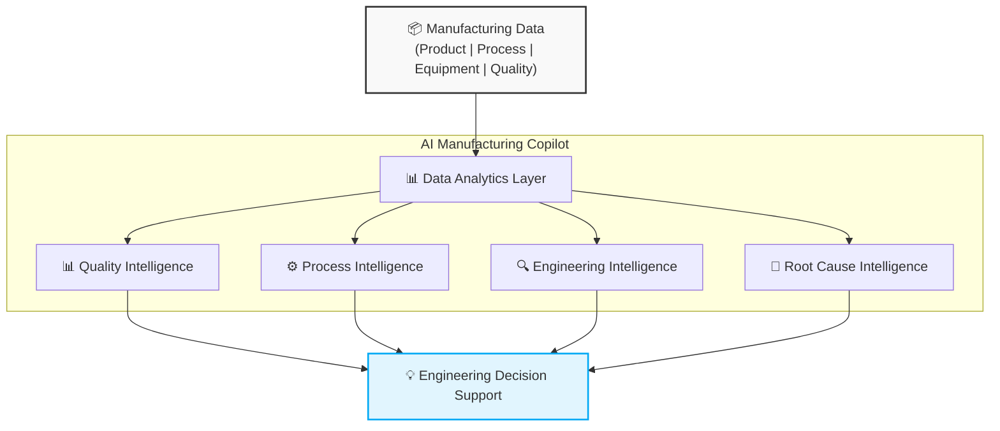

  <h1>🤖 AI Manufacturing Copilot</h1>
  
<i>AI-driven Intelligence for Next-Generation Electronics Manufacturing</i>

  
Building intelligent systems that connect manufacturing data, engineering knowledge, and AI to accelerate the development of future smart devices.

---

## 🌟 Vision

Modern electronics manufacturing is becoming increasingly complex. Products such as wearable devices, flexible electronics, and intelligent sensors require a deeper understanding of manufacturing processes, material behaviors, product performance, and reliability factors.

This project explores how AI can become an engineering partner by transforming manufacturing data into actionable insights:
> **Manufacturing Data ➔ AI Intelligence ➔ Decision Support ➔ Smart Improvement**

## 🧠 AI Manufacturing Intelligence Framework

| Capability | Icon | Purpose |
| :--- | :---: | :--- |
| **Quality Intelligence** | 📊 | Monitor product performance and identify quality risks |
| **Process Intelligence** | ⚙️ | Understand manufacturing behavior and variation |
| **Engineering Intelligence** | 🔍 | Discover relationships between factors and outcomes |
| **Root Cause Intelligence** | 🤖 | Assist investigation and continuous improvement |

## 🏗 System Architecture

## 🚀 Development Roadmap
    Phase 1
        Foundation (Current) : ✅ Quality data analysis
                             : ✅ Process monitoring
                             : ✅ Statistical process intelligence
                             : ✅ Manufacturing trend visualization
    Phase 2
        AI-assisted (Next)   : ⬜ Automated factor discovery
                             : ⬜ Pattern recognition
                             : ⬜ AI-assisted investigation
                             : ⬜ Engineering knowledge integration
    Phase 3
        Future Applications  : ⬜ Wearable device manufacturing
                             : ⬜ Flexible electronics
                             : ⬜ Stretchable sensors
                             : ⬜ Robotic skin systems

## 🔬 Prototype Direction

The initial development uses real-world manufacturing scenarios as validation cases, including:
* Manufacturing quality analysis
* Process behavior understanding
* Multi-factor relationship exploration
* Data-driven engineering investigation

*The framework is designed to be transferable across electronics manufacturing domains.*

## 🌱 Research Vision

Future electronics manufacturing will require more than automation. The next generation of manufacturing systems should be able to:

  <h5><code>Understand ➔ Analyze ➔ Predict ➔ Improve</code></h5>

By combining **Manufacturing Engineering + Artificial Intelligence + Data Intelligence**, this project explores a path toward intelligent manufacturing for future electronic technologies.

## 🛠 Technology Stack

`Python` • `Data Analytics` • `Machine Learning` • `Large Language Models (LLM)` • `AI Agents` • `Data Visualization`

---

> **🔒 Disclaimer:** This is an independent exploration project. All examples are generalized and contain no confidential information, proprietary data, or company-specific manufacturing details.
